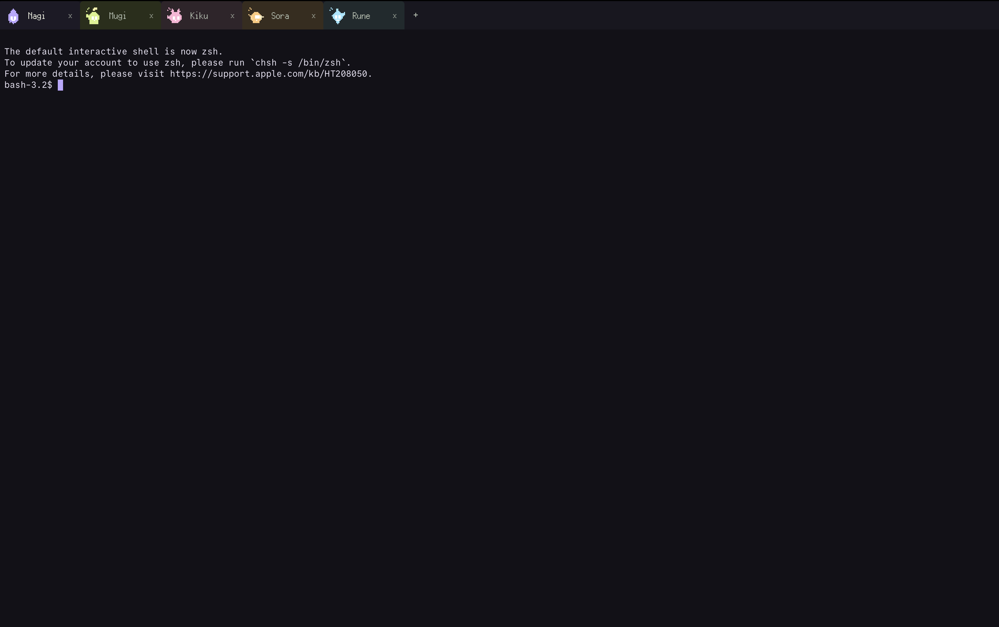

# Poké

Poke is a desktop terminal for people who run multiple AI agent CLIs and shell sessions in parallel.

Each terminal tab has a character and color. The goal is not decoration for its own sake: the character gives each session a recognizable face, and the color gives the terminal a quick visual identity. Together they make it easier to tell sessions apart, avoid selecting the wrong tab, and keep track of concurrent agent work.

Poke also lightly shows when a background session may need you. If a non-active terminal goes quiet, its character changes state so you can notice it without reading every terminal buffer. In other words, Poke helps you know when to poke a session.



## Concept

AI agent CLI work often means running several long-lived terminal sessions at once: one agent edits code, another runs tests, another investigates logs, and a normal shell stays nearby. Plain terminal tabs can make those sessions feel interchangeable, which increases cognitive load and makes tab selection mistakes easy.

Poke treats each terminal session as something you can recognize at a glance:

- Characters help identify sessions faster than text-only tab titles.
- Per-character colors make terminal backgrounds visually distinct.
- Attention state gives a small visual signal when a background session may need input.
- Real PTY-backed tabs keep the app usable as a normal terminal, not a wrapper around agent-specific features.

The product direction is to support human attention around AI agent CLI workflows while staying a normal terminal.

## Download

Download the macOS build from GitHub Releases:

- [Latest release](https://github.com/hayashikentaro/poke/releases/latest)

Unzip the file, then open `Poke.app`.

This is an unsigned macOS app. If macOS blocks the first launch, open it from Finder with right click, then `Open`.

## Features

- Real shell sessions backed by a Rust PTY
- Multiple terminal tabs, each with its own PTY session
- Character-based tab identity for recognizing sessions at a glance
- Per-character terminal colors to reduce session confusion
- Lightweight attention state for quiet background sessions
- Character picker and external character customization
- Drag-and-drop tab reordering
- Runtime terminal font size changes with `Command + +` and `Command + -`

Poke does not currently implement AI itself. It is meant to help humans operate AI agent CLIs and normal shells more safely in parallel. Notifications, persistence for tabs, command palette, and settings UI are intentionally not implemented yet.

## Requirements

- Node.js 20 or newer
- Rust and Cargo
- Platform-specific Tauri prerequisites for your operating system

On macOS, verify the required tools first:

```sh
node --version
npm --version
cargo --version
rustc --version
xcode-select -p
```

If `cargo` or `rustc` is missing, install Rust:

```sh
curl --proto '=https' --tlsv1.2 -sSf https://sh.rustup.rs | sh
```

After installation, restart the terminal or load Cargo into the current shell:

```sh
source "$HOME/.cargo/env"
```

If `xcode-select -p` fails on macOS, install Apple's command line tools:

```sh
xcode-select --install
```

## Install

```sh
npm install
```

## Run in development

```sh
npm run tauri dev
```

This launches the Tauri desktop app and starts the frontend dev server that the app loads internally.

If this fails with `failed to run 'cargo metadata'`, Cargo is not installed or is not on `PATH`. Run `cargo --version`; if it fails, install Rust using the command above.

## Verify Terminal Behavior

Use the Tauri app for terminal testing:

```sh
npm run tauri dev
```

In the app window, verify:

- A shell prompt appears.
- Typed commands are echoed.
- Command output appears in the terminal.
- The `+` button opens another terminal tab.
- Switching tabs preserves each terminal buffer.
- Closing a tab closes that tab's shell session.
- Tabs show character sprites.
- Clicking a character opens the character picker.
- A non-active tab switches to the `needs_you` sprite after 5 seconds without output.
- Activating a `needs_you` tab resets it to the idle sprite.
- Resizing the window keeps the terminal usable.
- Closing the app exits the shell session cleanly.

Do not verify PTY behavior by opening the Vite dev server directly in a browser. Browser-only mode does not provide Tauri commands or events, so the Rust PTY backend cannot run there.

## Configuration

Poke creates editable runtime settings under:

```sh
~/Library/Application Support/com.poke.terminal/
```

See [Configuration](docs/configuration.md) for how to edit terminal settings, character names, character colors, and character images.

## Frontend-only development

```sh
npm run dev
```

Frontend-only development is useful for static React layout work, but it does not start the Rust PTY backend.
